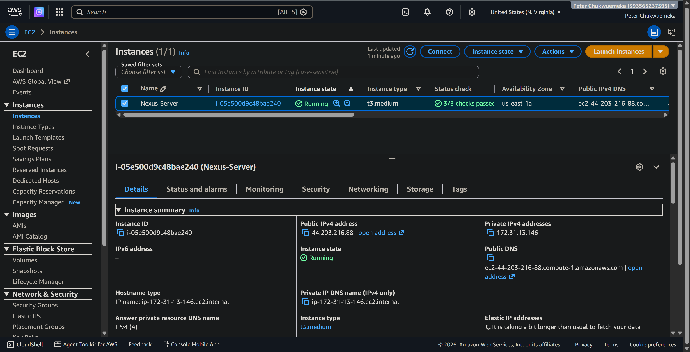

# Nexus Artifact Repository on AWS


> A production-style implementation of a Nexus Repository Manager deployed on AWS for managing, storing, versioning, and distributing software artifacts across the software development lifecycle.

---

# Project Overview

This repository documents the complete deployment, configuration, and management of a Nexus Repository Manager running on an AWS EC2 instance.

The project demonstrates how a centralized artifact repository can improve software delivery by securely storing build outputs generated from different build systems such as Maven and Gradle.

The implementation includes installation, repository management, artifact publishing, REST API usage, blob store configuration, cleanup policies, repository security, and administrative best practices.

Unlike storing build outputs directly inside source code repositories, Nexus provides centralized artifact management, versioning, controlled access, storage optimization, and faster dependency distribution for development teams.

This repository documents every major configuration performed throughout the project together with architecture diagrams, screenshots, implementation notes, and practical demonstrations.

---

# Project Objectives

The objectives of this project include:

- Deploy Nexus Repository Manager on AWS EC2
- Configure Java runtime environment
- Configure Nexus as a Linux service
- Secure the Nexus installation
- Create and manage hosted repositories
- Explore proxy and group repositories
- Publish Maven artifacts
- Publish Gradle artifacts
- Query repositories using the Nexus REST API
- Understand Components vs Assets
- Configure Blob Stores
- Create Cleanup Policies
- Execute Cleanup Tasks
- Document the entire deployment process
- Demonstrate artifact lifecycle management

---

# Project Architecture

```

> **Insert Architecture Diagram Here**

```

Example:

images/architecture-overview.png

---

# AWS Infrastructure

This project was deployed entirely on AWS.

Infrastructure Components

| Resource | Purpose |
|----------|----------|
| AWS EC2 | Nexus Server |
| Ubuntu Linux | Operating System |
| OpenJDK | Java Runtime |
| Nexus Repository Manager | Artifact Repository |
| Security Groups | Network Access Control |
| SSH | Remote Administration |

---

# Technology Stack

| Category | Technology |
|-----------|------------|
| Cloud | AWS |
| Operating System | Ubuntu Linux |
| Artifact Repository | Nexus Repository Manager |
| Build Tools | Maven, Gradle |
| Programming Language | Java |
| REST API | Nexus API |
| Version Control | Git |
| Documentation | Markdown |
| Diagramming | draw.io |

---

# Repository Structure

```

Nexus-artifact-repository/

├── README.md

├── architecture/

├── screenshots/

├── docs/

├── api/

├── scripts/

├── images/

└── LICENSE

```

---

# Solution Architecture

The workflow implemented in this project follows a standard artifact management pipeline.

Developer

↓

Build Tool

↓

Generated Artifact

↓

Nexus Repository

↓

Blob Store

↓

Consumers

Artifacts generated by Maven or Gradle are uploaded into Nexus where they are securely stored inside Blob Storage and later consumed by applications, deployment pipelines, or other development teams.

---

# Deployment Workflow

1. Launch AWS EC2 instance
2. Configure Security Groups
3. Connect using SSH
4. Install Java
5. Install Nexus Repository Manager
6. Configure Nexus User
7. Configure Permissions
8. Start Nexus
9. Access Nexus UI
10. Configure Repositories
11. Publish Artifacts
12. Query Repository via REST API
13. Configure Blob Store
14. Configure Cleanup Policies
15. Validate Repository Operations

---

# Project Demonstration

## AWS EC2 Instance

> Insert Screenshot Here

```



```

---

## SSH Connection

> Insert Screenshot Here

```


```

---

## Java Installation

> Insert Screenshot Here

```


```

---

## Nexus Installation

> Insert Screenshot Here

```


```

---

## Nexus Running

> Insert Screenshot Here

```


```

---

## Nexus Login

> Insert Screenshot Here

```


```

---

# Installing Nexus Repository Manager

The first phase of the project involved provisioning a dedicated Ubuntu EC2 instance on AWS and installing Nexus Repository Manager as a centralized artifact repository.

A dedicated Linux user was configured to run the Nexus service securely, ensuring the application did not execute with root privileges.

After installation, the necessary permissions were configured, the service was started, and network access was enabled through AWS Security Groups.

---

## Launch AWS EC2 Instance

> Insert Screenshot Here

```text
screenshots/07-aws-instance.png
```

---

## Connect to Server via SSH

> Insert Screenshot Here

```text
screenshots/08-ssh-session.png
```

---

## Install Java Runtime

> Insert Screenshot Here

```text
screenshots/09-java-installation.png
```

---

## Download Nexus Repository Manager

> Insert Screenshot Here

```text
screenshots/10-download-nexus.png
```

---

## Extract Nexus Package

> Insert Screenshot Here

```text
screenshots/11-extract-package.png
```

---

## Create Dedicated Nexus User

Running enterprise applications with dedicated service accounts improves security by limiting privileges and isolating processes.

> Insert Screenshot Here

```text
screenshots/12-create-user.png
```

---

## Configure File Permissions

Ownership of the Nexus installation and working directories was assigned to the Nexus user.

> Insert Screenshot Here

```text
screenshots/13-file-permissions.png
```

---

## Configure Nexus Runtime

The Nexus configuration was updated to ensure the application always starts using the dedicated service account.

> Insert Screenshot Here

```text
screenshots/14-runtime-config.png
```

---

## Start Nexus

Once configuration was completed, the Nexus service was started.

> Insert Screenshot Here

```text
screenshots/15-start-nexus.png
```

---

## Verify Running Processes

The running process was verified from the Linux terminal.

> Insert Screenshot Here

```text
screenshots/16-process-check.png
```

---

## Access Nexus Web Interface

After startup, the Nexus web interface became available through the EC2 public IP address.

> Insert Screenshot Here

```text
screenshots/17-nexus-dashboard.png
```

---

# Nexus Repository Types

One of the primary responsibilities of Nexus Repository Manager is organizing artifacts into repositories based on how they are consumed.

Three repository types were explored during this project.

---

## Hosted Repository

Hosted repositories store internally produced artifacts.

Examples include:

- Company libraries
- Internal Java packages
- Build outputs
- Release artifacts

Characteristics:

- Supports uploads
- Stores organization-owned artifacts
- Version controlled
- Highly available

> Insert Screenshot Here

```text
screenshots/18-hosted-repository.png
```

---

## Proxy Repository

Proxy repositories cache packages downloaded from external repositories.

Benefits include:

- Faster dependency downloads
- Reduced internet traffic
- Improved reliability
- Local caching

> Insert Screenshot Here

```text
screenshots/19-proxy-repository.png
```

---

## Group Repository

Group repositories combine multiple repositories behind a single endpoint, simplifying dependency management for developers.

Advantages include:

- Single repository URL
- Simplified build configuration
- Aggregated repositories
- Easier maintenance

> Insert Screenshot Here

```text
screenshots/20-group-repository.png
```

---

# Publishing Maven Artifacts

One of the most common use cases for Nexus is storing Maven build artifacts.

During this project:

- A Maven project was built
- A JAR artifact was generated
- The artifact was uploaded into Nexus
- Repository contents were verified

---

## Maven Build

> Insert Screenshot Here

```text
screenshots/21-maven-build.png
```

---

## Maven Upload

> Insert Screenshot Here

```text
screenshots/22-maven-upload.png
```

---

## Verify Uploaded Artifact

> Insert Screenshot Here

```text
screenshots/23-maven-verification.png
```

---

# Publishing Gradle Artifacts

Gradle projects can also publish build artifacts directly into Nexus repositories.

The project demonstrated the complete Gradle artifact publishing workflow.

Steps completed:

- Build project
- Generate JAR
- Configure publishing
- Upload artifact
- Verify upload

---

## Gradle Build

> Insert Screenshot Here

```text
screenshots/24-gradle-build.png
```

---

## Gradle Upload

> Insert Screenshot Here

```text
screenshots/25-gradle-upload.png
```

---

## Verify Uploaded Gradle Artifact

> Insert Screenshot Here

```text
screenshots/26-gradle-verification.png
```

---

# Nexus REST API

Nexus Repository Manager provides a comprehensive REST API that enables automation, integration with CI/CD pipelines, repository management, artifact retrieval, and administrative operations.

Instead of performing every operation through the graphical interface, many repository tasks can be automated using HTTP requests.

During this project, the REST API was used to explore repositories, components, and stored assets.

---

## Why Use the Nexus REST API?

The REST API enables engineers to:

- Automate repository administration
- Query repository information
- Retrieve stored artifacts
- Integrate Nexus into CI/CD pipelines
- Build deployment automation
- Perform repository audits
- Reduce repetitive manual tasks

---

## Query Available Repositories

The first API request retrieves all repositories configured within Nexus Repository Manager.

> **Insert Screenshot Here**

```text
screenshots/27-api-repositories.png
```

---

## Query Repository Components

Components represent logical software packages stored inside a repository.

Examples include:

- Java Libraries
- Maven Packages
- Gradle Packages
- Release Artifacts

During this project, repository components were queried successfully using the Nexus API.

> **Insert Screenshot Here**

```text
screenshots/28-api-components.png
```

---

## Query Repository Assets

Assets are the actual files associated with a component.

Examples include:

- JAR files
- POM files
- Metadata
- Checksums

Assets provide the physical files downloaded by applications and build systems.

> **Insert Screenshot Here**

```text
screenshots/29-api-assets.png
```

---

# Understanding Components vs Assets

One of the most important concepts within Nexus Repository Manager is understanding the distinction between Components and Assets.

Although closely related, they represent different layers of artifact management.

---

## Component

A Component represents a logical software package.

Examples include:

- my-library
- payment-service
- customer-api
- authentication-service

A component groups together all files that belong to the same software release.

---

## Asset

An Asset is an individual file that belongs to a Component.

Examples include:

- application.jar
- application.pom
- application.sha1
- application.md5

Each component can contain multiple assets.

---

## Relationship

```text
Component

│

├── application.jar

├── application.pom

├── application.sha1

└── application.md5
```

---

> **Insert Screenshot Here**

```text
screenshots/30-components-assets.png
```

---

# Blob Store Configuration

Blob Stores are the storage backends used by Nexus Repository Manager to physically store artifacts.

Rather than storing files directly inside repositories, repositories reference a Blob Store where the actual files are maintained.

This separation provides improved storage management, scalability, backup strategies, and repository administration.

---

## Blob Store Objectives

The Blob Store created during this project provides:

- Centralized artifact storage
- Efficient disk utilization
- Repository abstraction
- Improved backup management
- Storage scalability

---

## Create Blob Store

A new Blob Store was created and configured for artifact storage.

> **Insert Screenshot Here**

```text
screenshots/31-create-blob-store.png
```

---

## Assign Repository to Blob Store

Repositories were configured to use the newly created Blob Store.

This ensures that uploaded artifacts are stored in the appropriate storage backend.

> **Insert Screenshot Here**

```text
screenshots/32-blob-store-assignment.png
```

---

# Cleanup Policies

As repositories grow over time, unused artifacts consume storage and increase maintenance overhead.

Cleanup Policies automate repository housekeeping by identifying artifacts that meet predefined criteria for removal.

This helps maintain an efficient repository environment while reducing storage costs and administrative effort.

---

## Why Cleanup Policies Matter

Benefits include:

- Reduced storage consumption
- Improved repository performance
- Automated maintenance
- Removal of obsolete artifacts
- Better storage lifecycle management
- Reduced operational overhead

---

## Create Cleanup Policy

A cleanup policy was created to define retention rules for repository artifacts.

> **Insert Screenshot Here**

```text
screenshots/33-create-cleanup-policy.png
```

---

## Attach Cleanup Policy to Repository

The cleanup policy was associated with the appropriate repository.

> **Insert Screenshot Here**

```text
screenshots/34-attach-cleanup-policy.png
```

---

## Execute Cleanup Task

A cleanup task was manually executed to validate that the policy worked as expected.

> **Insert Screenshot Here**

```text
screenshots/35-run-cleanup-task.png
```

---

## Verify Cleanup Results

Repository contents were reviewed after execution to confirm successful cleanup.

> **Insert Screenshot Here**

```text
screenshots/36-cleanup-results.png
```

---

# Key Skills Demonstrated

This project demonstrates practical experience with:

- AWS EC2 administration
- Linux server management
- Java runtime configuration
- Nexus Repository Manager deployment
- Repository administration
- Maven artifact publishing
- Gradle artifact publishing
- Repository security
- REST API usage
- Blob Store management
- Components and Assets
- Cleanup policy configuration
- Artifact lifecycle management
- Documentation
- DevOps operational practices

---

# Project Outcomes

At the completion of this project, I successfully:

- Deployed Nexus Repository Manager on AWS
- Configured a production-style repository environment
- Managed multiple repository types
- Published Maven artifacts
- Published Gradle artifacts
- Queried repository data using the REST API
- Configured Blob Stores
- Implemented automated cleanup policies
- Validated artifact storage and retrieval workflows
- Documented the complete implementation process with screenshots and supporting documentation

---

# Security Considerations

Securing an artifact repository is a critical aspect of software supply chain management. Since Nexus stores production-ready build artifacts, proper access control and infrastructure hardening are essential.

Throughout this project, security best practices were incorporated into the deployment and administration of the Nexus Repository Manager.

## Security Measures Implemented

- Deployed Nexus on a dedicated AWS EC2 instance
- Restricted administrative access using SSH
- Configured AWS Security Groups to control inbound traffic
- Created a dedicated Linux user to run the Nexus service
- Avoided running Nexus as the root user
- Used role-based user accounts within Nexus
- Secured artifact upload permissions
- Restricted repository administration to authorized users

> **Insert Screenshot Here**

```text
screenshots/37-security-group.png
```

---

# Repository Management Best Practices

Effective repository management ensures artifact consistency, improves build performance, and supports long-term maintainability.

The following practices were applied throughout this project:

- Separate repositories by purpose
- Use meaningful repository names
- Restrict upload permissions
- Remove obsolete artifacts using Cleanup Policies
- Monitor Blob Store utilization
- Regularly review repository contents
- Document repository configurations
- Automate repetitive tasks through the REST API
- Maintain version consistency
- Keep repository structures organized

---

# Challenges Encountered

Every infrastructure deployment presents opportunities to troubleshoot, learn, and refine operational skills.

Some of the challenges encountered during this implementation included:

### Service Startup Configuration

Ensuring the Nexus service started correctly under a dedicated Linux user required proper permission management and runtime configuration.

---

### Network Accessibility

Validating AWS Security Group rules and ensuring the Nexus web interface was reachable from the browser.

---

### Artifact Publishing

Verifying Maven and Gradle publishing configurations to ensure successful uploads into the correct hosted repositories.

---

### REST API Validation

Testing repository endpoints and confirming successful responses while understanding the structure of Components and Assets.

---

### Repository Organization

Designing repository structures that support scalable artifact management and future growth.

> **Insert Screenshot Here**

```text
screenshots/38-troubleshooting.png
```

---

# Lessons Learned

This project provided valuable experience in artifact management and reinforced several important DevOps concepts.

Key lessons include:

- Artifact repositories are essential components of modern CI/CD pipelines.
- Separating source code from build artifacts improves software lifecycle management.
- Repository types serve different operational purposes and should be selected based on use case.
- Blob Stores abstract physical storage from logical repositories.
- Cleanup Policies help control storage growth and improve repository maintenance.
- REST APIs enable automation and integration across the software delivery lifecycle.
- Proper Linux permissions enhance application security and operational stability.
- AWS provides a reliable and scalable platform for hosting DevOps infrastructure.

---

# Future Improvements

Potential enhancements for this implementation include:

- Integrate Nexus with Jenkins pipelines for automated artifact publishing
- Configure Docker image repositories within Nexus
- Enable HTTPS using a reverse proxy and SSL/TLS certificates
- Implement automated backups for Blob Stores
- Integrate external authentication providers such as LDAP
- Configure repository replication for disaster recovery
- Deploy Nexus behind an Application Load Balancer
- Monitor Nexus using Prometheus and Grafana
- Automate infrastructure provisioning with Infrastructure as Code
- Implement high-availability deployment strategies

---

# Repository Contents

This repository contains the following resources:

```text
.
├── README.md
├── architecture/
├── api/
├── docs/
├── images/
├── screenshots/
├── scripts/
├── LICENSE
└── .gitignore
```

---

# Documentation

Additional documentation is organized into the `docs/` directory.

| Document | Description |
|----------|-------------|
| installation.md | Complete installation and configuration guide |
| repository-management.md | Repository creation and management |
| api-reference.md | Nexus REST API examples |
| blob-store.md | Blob Store concepts and configuration |
| cleanup-policy.md | Cleanup policy configuration and execution |
| troubleshooting.md | Common issues and resolutions |
| commands.md | Frequently used Linux and Nexus commands |

---

# References

The implementation in this repository is based on practical deployment, experimentation, and official product documentation.

Useful references include:

- Nexus Repository Manager documentation
- Nexus REST API documentation
- AWS EC2 documentation
- Ubuntu Server documentation
- Maven documentation
- Gradle documentation

---

# Conclusion

This project demonstrates the deployment and administration of a Nexus Repository Manager on AWS, covering the complete artifact management lifecycle from installation to repository administration, artifact publishing, REST API interaction, Blob Store configuration, and automated cleanup policies.

By implementing these features in a practical environment, the project showcases skills in Linux administration, cloud infrastructure, artifact lifecycle management, DevOps operations, and technical documentation.

The accompanying architecture diagrams, screenshots, terminal outputs, and demonstration video provide a comprehensive record of the implementation and can serve as a reference for similar deployments in production or learning environments.

---

# Author

**Chukwuemeka Peter Eze**

Cloud | DevOps | Platform Engineering | AWS | Linux | CI/CD | Infrastructure Automation

---

# License

This project is licensed under the MIT License.

See the LICENSE file for additional information.

---

# Acknowledgements

This repository documents an independently completed implementation of a Nexus Repository Manager deployed on AWS, including practical exercises, supporting documentation, architecture diagrams, screenshots, and demonstration materials.

The focus of this repository is to showcase hands-on experience with artifact repository management, infrastructure administration, and DevOps practices in a cloud environment.
