# Nexus Artifact Repository on AWS

<p align="center">


</p>

> A practical implementation of a self-managed Nexus Repository Manager running on AWS EC2, covering artifact publishing, repository administration, API interaction, storage management, and artifact lifecycle control.

---

## Overview

This repository documents the deployment and operation of **Nexus Repository Manager on an AWS EC2 instance running Ubuntu Linux**.

The implementation goes beyond installing Nexus. It demonstrates the operational model of an artifact repository: software artifacts are published into repositories, repository storage is backed by Blob Stores, Nexus exposes repository and artifact information through its REST API, and Cleanup Policies can be used to control artifact retention.

The implementation also covers publishing Java artifacts using **Maven and Gradle**, administering repositories through the Nexus UI, querying repository information through the API, and validating the resulting artifact storage.

The repository is structured around **implementation evidence rather than theoretical documentation**. Screenshots, architecture diagrams, source code, configuration notes, and operational documentation are included where they provide evidence of the work performed.

---

## Engineering Scope

The implementation covers five connected areas:

| Area                 | Demonstrated Capability                                      |
| -------------------- | ------------------------------------------------------------ |
| Infrastructure       | AWS EC2 provisioning and network access                      |
| Linux Administration | User isolation, permissions, processes and service operation |
| Artifact Management  | Hosted, proxy and group repository concepts                  |
| Developer Workflow   | Maven and Gradle artifact publishing                         |
| Platform Operations  | REST API, Blob Stores and Cleanup Policies                   |

---

## Architecture

The environment consists of an AWS EC2 instance running Ubuntu Linux with Nexus Repository Manager operating as the artifact management layer.

```text
                         Developer / Build Process
                                  │
                    ┌─────────────┴─────────────┐
                    │                           │
                  Maven                      Gradle
                    │                           │
                    └─────────────┬─────────────┘
                                  │
                                  ▼
                         Nexus Repository
                         Manager on EC2
                                  │
              ┌───────────────────┼───────────────────┐
              │                   │                   │
              ▼                   ▼                   ▼
           Hosted               Proxy               Group
          Repository          Repository          Repository
              │                   │                   │
              └───────────────────┴───────────────────┘
                                  │
                                  ▼
                             Blob Store
                                  │
                                  ▼
                         Artifact / Asset Data
```

### Network Boundary

```text
Internet
   │
   │ SSH / HTTP
   ▼
AWS Security Group
   │
   ├── SSH : 22
   │
   └── Nexus : 8081
          │
          ▼
     Ubuntu EC2
          │
          ▼
     Nexus Service
```

The architecture source and exported diagram are maintained under:

```text
architecture/
├── nexus-architecture.drawio
└── nexus-architecture.png
```

---

## Deployment Model

Nexus was deployed directly onto an AWS EC2 instance running Ubuntu Linux.

The service was configured to run under a dedicated `nexus` operating-system user rather than the root account. Ownership and permissions were configured for the Nexus installation and working directories before the service was started.

The deployment sequence was:

```text
AWS EC2
   ↓
Ubuntu Linux
   ↓
Java Runtime
   ↓
Nexus Installation
   ↓
Dedicated nexus User
   ↓
File Ownership / Permissions
   ↓
Nexus Configuration
   ↓
Nexus Service
   ↓
Port 8081
   ↓
Nexus Web Interface
```

This follows the operational principle that application services should run with their own restricted service identity rather than directly as root.

Detailed deployment notes are available in:

[`docs/deployment.md`](docs/deployment.md)

---

## Artifact Repository Model

Nexus provides a central location for storing and retrieving build artifacts.

An artifact may be a package such as a JAR, WAR, ZIP or another supported package format. The repository manager provides a consistent interface for publishing and retrieving these artifacts rather than requiring each team or application to manage artifact storage independently.

The implementation explored the three primary repository behaviors:

| Repository | Purpose                                                    |
| ---------- | ---------------------------------------------------------- |
| Hosted     | Stores internally published artifacts                      |
| Proxy      | Acts as an intermediary to another repository              |
| Group      | Provides a combined access point for multiple repositories |

The practical work also covered repository formats including Maven-based Java artifacts.

---

## Artifact Publishing

The repository includes practical publishing workflows for Java artifacts built with:

* Maven
* Gradle

The publishing model is:

```text
Source Code
     │
     ▼
Build Tool
     │
     ├── Maven
     │
     └── Gradle
     │
     ▼
Build Artifact
     │
     ▼
Nexus Hosted Repository
     │
     ▼
Component
     │
     └── Assets
```

Publishing requires the build tool to be configured with the Nexus repository address and appropriate credentials.

---

## Nexus API

Nexus was also accessed through its REST API rather than relying exclusively on the graphical interface.

The API work covered queries involving:

* Repositories
* Components
* Assets

The interaction model used HTTP requests through command-line tooling such as `curl`.

```text
Client
  │
  │ HTTP Request
  ▼
Nexus REST API
  │
  ├── Repository information
  ├── Component information
  └── Asset information
```

This provides an automation-oriented interface that can be consumed by scripts and CI/CD systems. The implementation follows the practical principle of using the API documentation as the authoritative reference for available endpoints and request formats.

Detailed API evidence is documented in:

[`docs/operations.md`](docs/operations.md)

---

## Storage Model

A key part of the implementation was understanding the relationship between **repositories, components, assets, and Blob Stores**.

A component represents the logical artifact being managed, while assets represent the physical files associated with that component.

The storage model can therefore be viewed as:

```text
Repository
    │
    ▼
Component
    │
    ├── Asset
    ├── Asset
    └── Asset
          │
          ▼
      Blob Store
```

A dedicated Blob Store was created during the practical implementation.

---

## Artifact Lifecycle Management

Artifact storage is not only about uploading files. Over time, unused artifacts can consume significant storage.

Nexus Cleanup Policies provide a mechanism for defining conditions under which artifacts can be removed. Scheduled tasks can then execute those cleanup operations against repositories.

The implementation included:

* Creating a Cleanup Policy
* Attaching the policy to a repository
* Executing the cleanup task manually

This establishes the basic lifecycle-management model:

```text
Artifact Published
       │
       ▼
Repository
       │
       ▼
Retention Criteria
       │
       ▼
Cleanup Policy
       │
       ▼
Scheduled / Manual Task
       │
       ▼
Eligible Artifacts Removed
```

---

## Evidence

The repository uses screenshots as implementation evidence rather than decorative images.

### Infrastructure


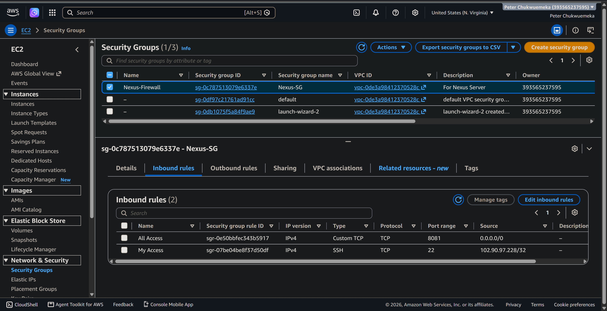

### Linux Configuration

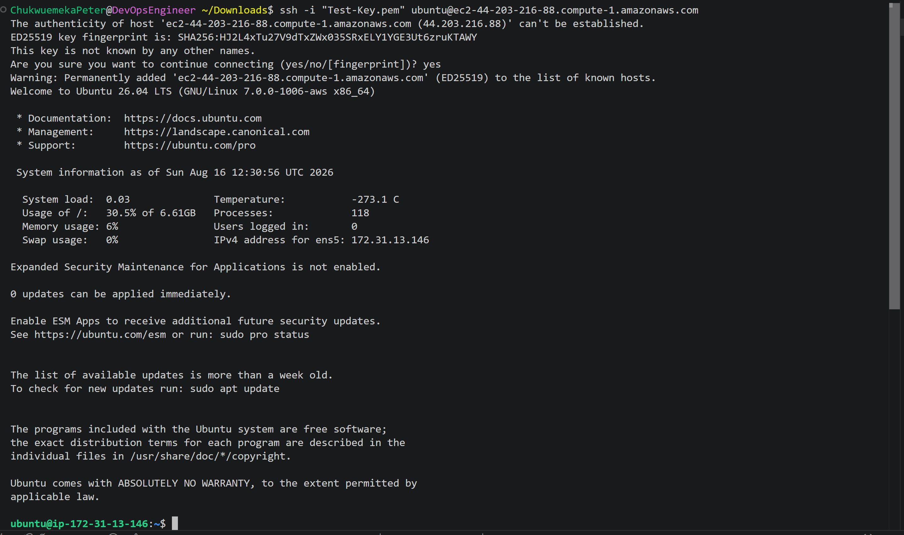

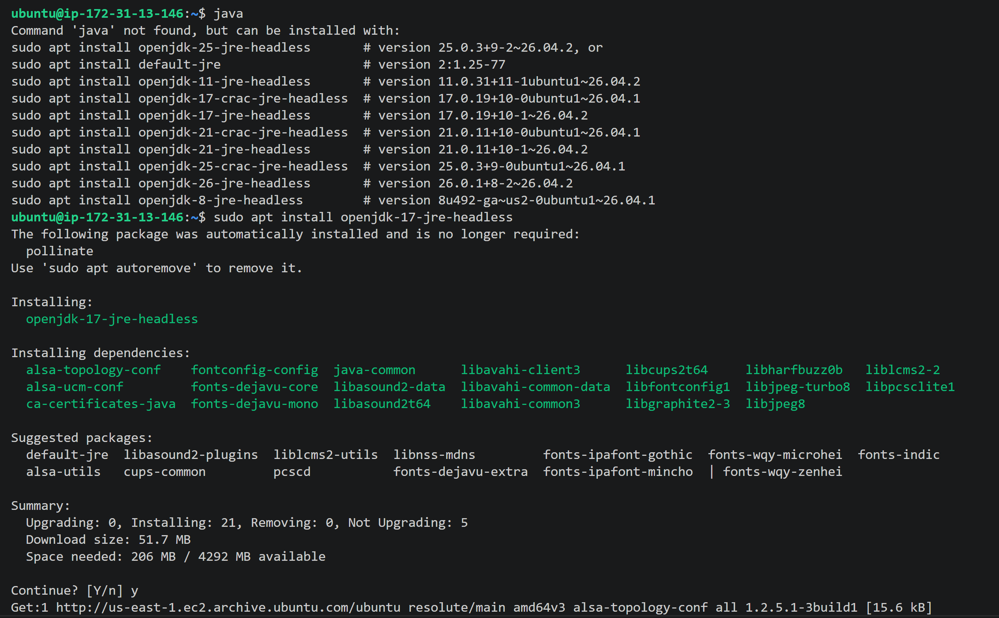

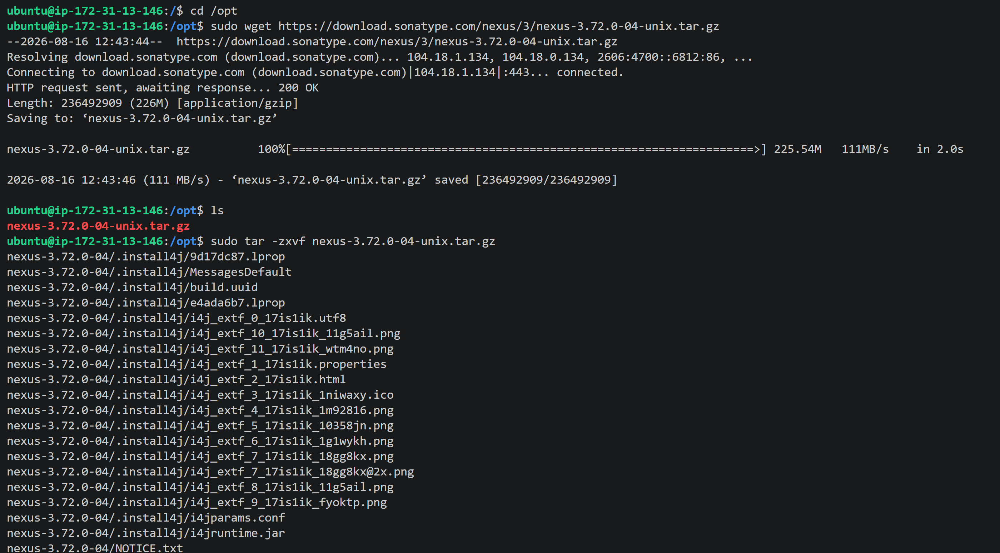

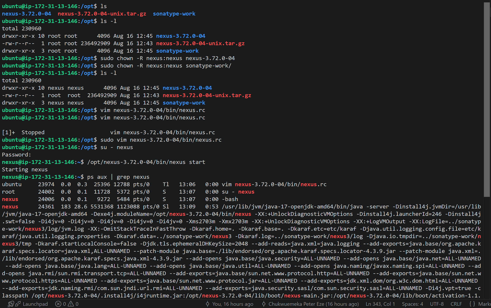

### Nexus Administration

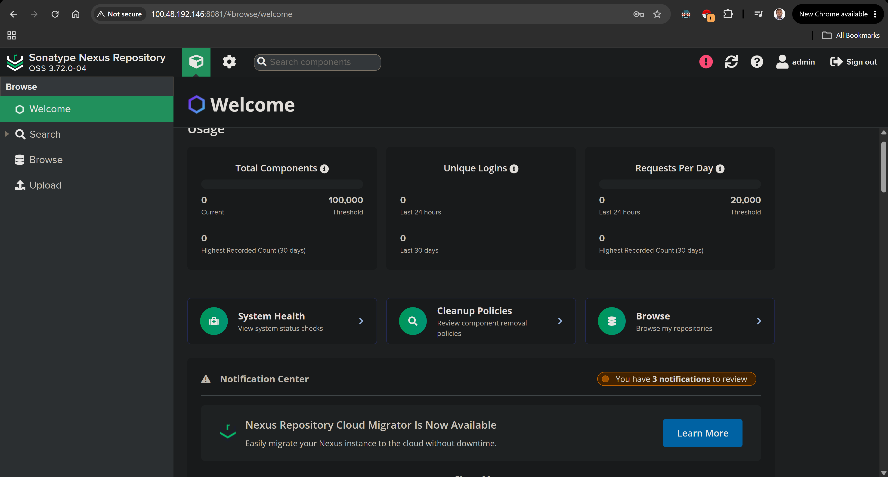

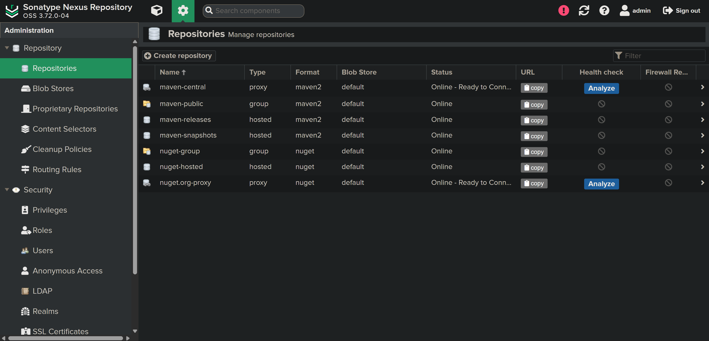

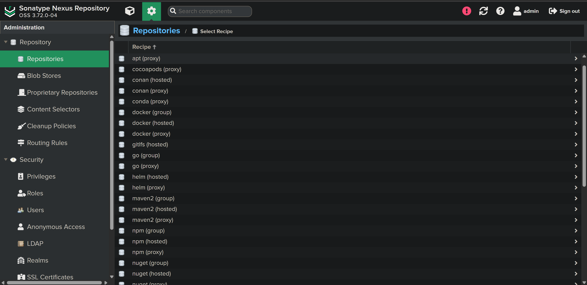

### Artifact Publishing

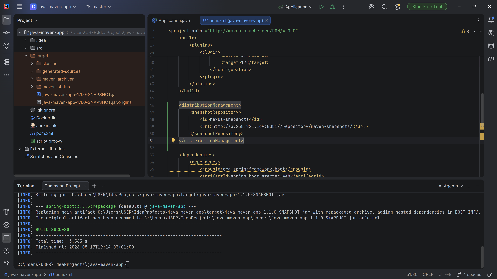

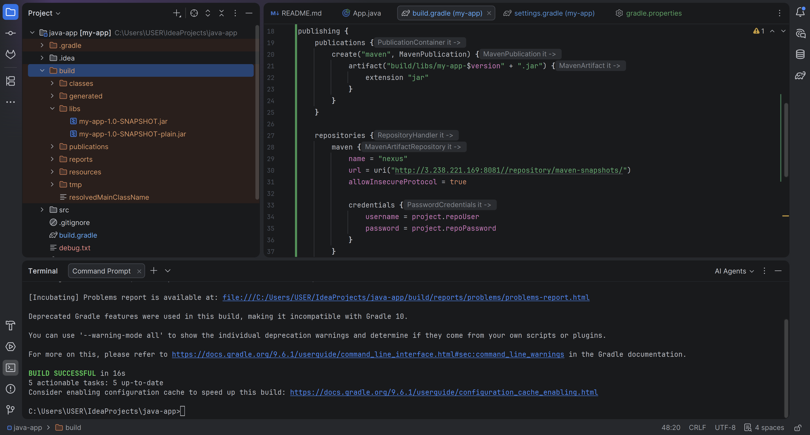

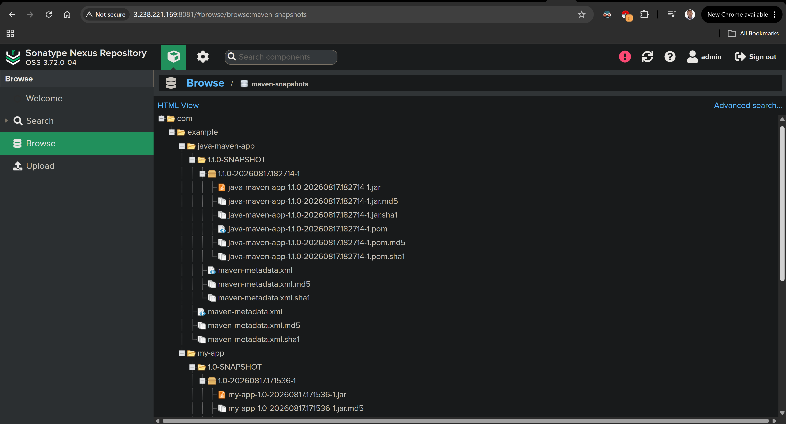

### API

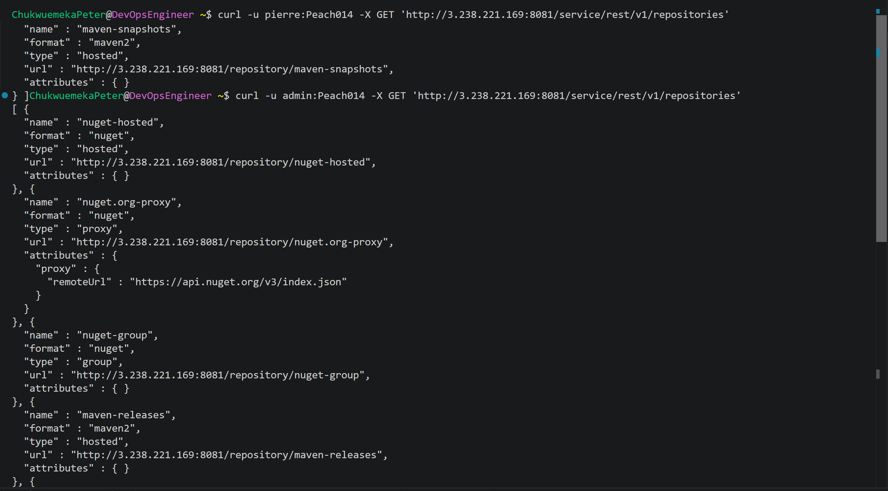

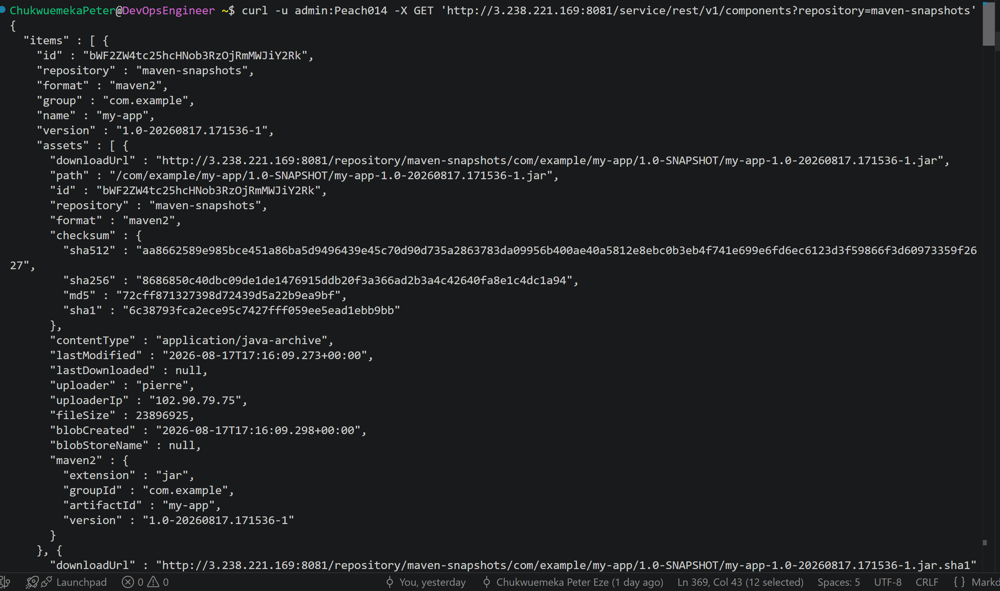


### Storage and Lifecycle

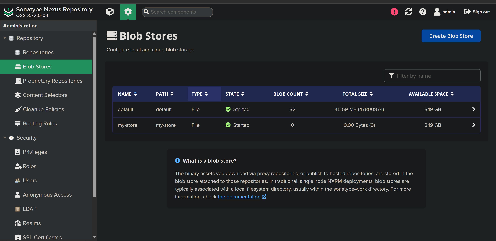

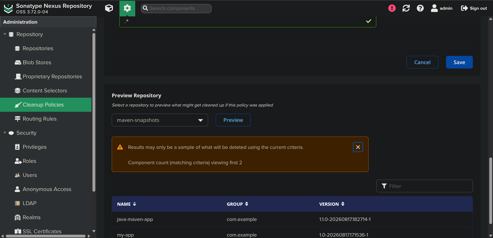

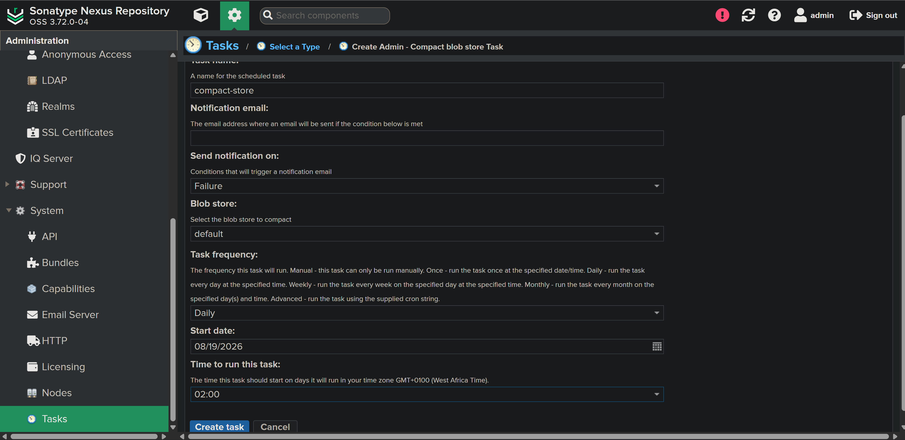

The screenshot sequence follows the implementation flow from infrastructure through artifact lifecycle management.

---

## Repository Structure

```text
Nexus-artifact-repository/
│
├── README.md
├── LICENSE
├── .gitignore
│
├── architecture/
│   ├── nexus-architecture.drawio
│   └── nexus-architecture.png
│
├── docs/
│   ├── deployment.md
│   └── operations.md
│
├── screenshots/
│   ├── 01-ec2-instance.png
│   ├── 02-security-group.png
│   ├── 03-ssh-access.png
│   ├── 04-java-runtime.png
│   ├── 05-nexus-installation.png
│   ├── 06-nexus-service.png
│   ├── 07-nexus-dashboard.png
│   ├── 08-repository-configuration.png
│   ├── 09-repository-types.png
│   ├── 10-maven-artifact.png
│   ├── 11-gradle-artifact.png
│   ├── 12-published-artifact.png
│   ├── 13-nexus-api.png
│   ├── 14-repository-query.png
│   ├── 15-component-asset-query.png
│   ├── 16-blob-store.png
│   ├── 17-cleanup-policy.png
│   └── 18-cleanup-task.png
│
├── source/
│   ├── maven/
│   └── gradle/
│
└── scripts/
    └── README.md
```

The `source/` directory contains the actual application/build files used for the artifact publishing exercises. It is intentionally kept separate from Nexus administration material so the repository clearly distinguishes **artifact production** from **artifact management**.

---

## Operational Evidence

The implementation demonstrated the following operational capabilities:

* Provisioning an EC2-based Linux environment
* Remote administration through SSH
* Installing and configuring the Java runtime
* Installing Nexus Repository Manager
* Creating a dedicated service user
* Managing application ownership and permissions
* Starting and validating the Nexus service
* Exposing Nexus through port 8081
* Managing hosted, proxy and group repositories
* Publishing Maven artifacts
* Publishing Gradle artifacts
* Querying Nexus through its REST API
* Working with repositories, components and assets
* Creating and using Blob Stores
* Creating Cleanup Policies
* Executing cleanup tasks

These activities are directly reflected in the practical checklist and implementation scope.

---

## Engineering Decisions

Several implementation choices are intentional:

### Dedicated Service Identity

Nexus runs under a dedicated operating-system user instead of root. This establishes clearer ownership boundaries and reduces unnecessary privileges.

### Repository Separation

Repository types are treated according to their responsibility: hosted repositories store internally produced artifacts, proxy repositories provide access to external repositories, and group repositories provide an aggregated access point.

### API-Based Interaction

The REST API is treated as an operational interface rather than merely a feature of the product. Repository and artifact information can therefore be queried programmatically.

### Lifecycle Management

Artifact storage is treated as a lifecycle problem. Cleanup Policies and scheduled tasks provide a mechanism for controlling retained artifacts instead of allowing storage to grow indefinitely.

---

## What This Project Demonstrates

This repository demonstrates practical understanding of the artifact-management layer that sits between **software build systems and deployment systems**.

The important capability is not simply installing Nexus. It is understanding how:

```text
Source
  ↓
Build
  ↓
Artifact
  ↓
Repository
  ↓
Storage
  ↓
Lifecycle
  ↓
Consumption
```

connects into a software delivery system.

That model becomes particularly important when artifact management is integrated into CI/CD pipelines, where reliable artifact storage and retrieval become part of the delivery path.

---

## Documentation

| Document                                   | Purpose                                                                      |
| ------------------------------------------ | ---------------------------------------------------------------------------- |
| [`docs/deployment.md`](docs/deployment.md) | Infrastructure, Linux configuration and Nexus deployment                     |
| [`docs/operations.md`](docs/operations.md) | Repository administration, publishing, API, storage and lifecycle operations |

The documentation is intentionally limited to material that supports the implementation and demonstrates engineering understanding.

---

## Validation

The implementation was validated through the following observable outcomes:

* Nexus was accessible through its web interface.
* The Nexus service ran under the configured service user.
* Repositories were created and managed.
* Maven and Gradle artifacts were published.
* Repository information could be queried through the REST API.
* Components and assets could be inspected.
* A Blob Store was created.
* A Cleanup Policy was created and associated with a repository.
* Cleanup execution was tested manually.

---

## Project Status

**Status:** Completed

The repository represents a working implementation and documented operational study of Nexus Repository Manager deployed on AWS EC2.

The emphasis is on demonstrating the relationship between cloud infrastructure, Linux service administration, artifact production, repository management, API-driven operations, storage, and artifact lifecycle management.

---

# Author

**Chukwuemeka Peter Eze**

Cloud • DevOps • Platform Engineering

GitHub: https://github.com/Chukwuemeka-Peter-Eze

LinkedIn: https://www.linkedin.com/in/chukwuemekapetereze/

Notion: https://lumpy-bubble-7b0.notion.site/Artifact-Repository-Manager-with-Nexus-3a046a96f974805bbd59ffcf1c64c86e?source=copy_link

---